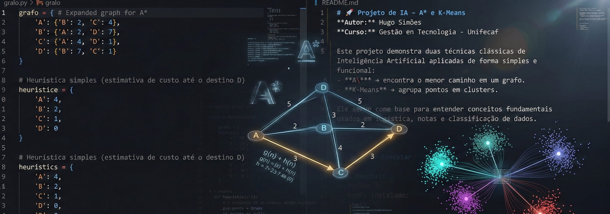

<p align="center">
  
</p>


# 🚀 Projeto de IA — A* e K‑Means
**Autor:** Hugo Simões  
**Curso:** Gestão em Tecnologia – Unifecaf  


Este projeto demonstra duas técnicas clássicas de Inteligência Artificial aplicadas de forma simples:

- **A\*** → encontra o menor caminho em um grafo.  
- **K‑Means** → agrupa pontos em clusters.  

O objetivo é apresentar conceitos fundamentais usados em logística, rotas e classificação de dados.

---

## 📌 Objetivos do Projeto

- Aplicar algoritmos clássicos de IA em um problema simples.
- Demonstrar o funcionamento do **A\*** em um grafo pequeno.
- Agrupar pontos usando **K‑Means** para simular agrupamento de entregas.
- Criar um projeto limpo, funcional e fácil de explicar no vídeo da disciplina.

---

## 🧠 Tecnologias Utilizadas

- **Python 3**
- **NumPy** (para o K‑Means)
- Algoritmos implementados manualmente:
  - A\*
  - K‑Means (versão minimalista)

---

## ▶️ Como Executar

### ✔ Requisitos
- Python 3+
- NumPy instalado:

```bash
pip install numpy
